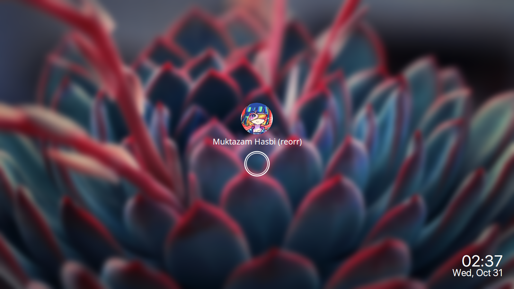
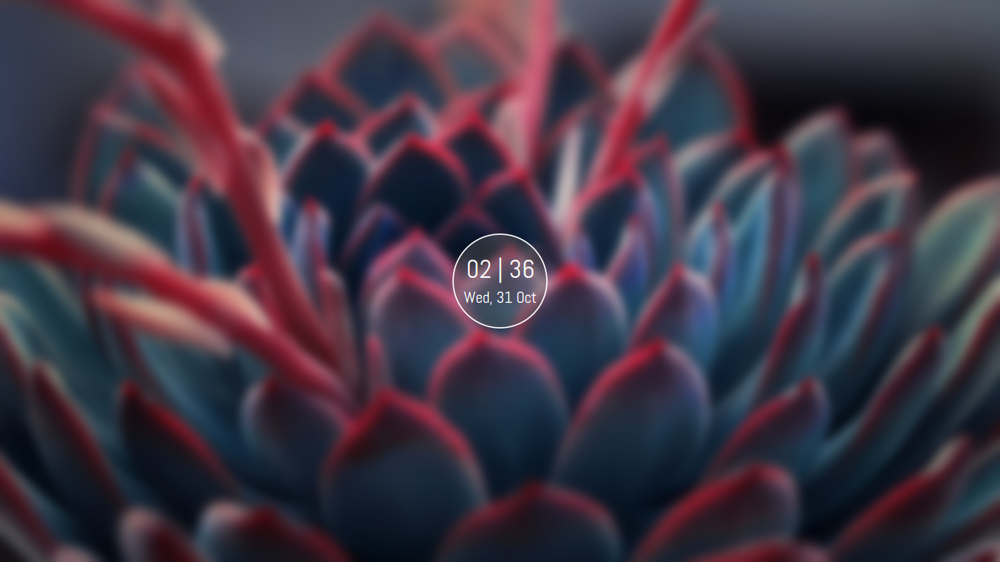

<div align="center">
	<h1>mantablockscreen</h1>
	<p>Another i3lock-color wrapper that mantab</p>
</div>

## Dependencies
- `bash`
- `imagemagick`
- `i3lock-color`
- [SF Pro Display Font](https://github.com/sahibjotsaggu/San-Francisco-Pro-Fonts)
- [Abel Font](https://github.com/google/fonts/tree/master/ofl/abel)
### Optional
- `compton`

## Installation
1. Install the required dependencies
2. Clone this repo to your local storage
```
$ git clone https://github.com/reorr/mantablockscreen
$ cd mantablockscreen
```
3. Run `$ sudo make install`

## Usage
To create cached images run command below <br>
`$ mantablockscreen -i PATH/TO/YOUR/IMAGE` <br>
After that you can run `mantablockscreen` with or without argument below <br>
```
$ mantablockscreen
$ mantablockscreen -sc
$ mantablockscreen -cc
```
To enable slowfade effect you must use compton with fade enabled and run it with --dbus argument `compton --dbus`

### in action
<div align="center">
	
</div>

## Preview
### default

### stackclock

### circleclock


## Credit
- inspired by [betterlockscreen](https://github.com/pavanjadhaw/betterlockscreen)
- slowfade script by [Nanda Okitavera](https://github.com/yuune)
- thanks to [Ghani Rafif](https://github.com/ekickx/) for fixing uncentered ring